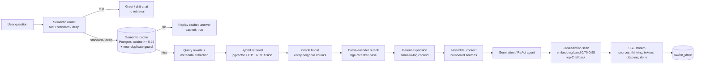

# METIS — The Self-Organizing Knowledge Library

> **One-liner:** The library that reads itself. Drop in documents and images; Metis builds a
> knowledge graph of everything inside, answers questions with citations, surfaces
> cross-document connections you didn't know existed, and flags contradictions between sources.

## Stack

FastAPI (async) · Postgres + pgvector · Neo4j (GDS) · Redis · sentence-transformers (bge-m3,
CLIP, bge-reranker) · LLM gateway (Groq + Gemini + ollama, free tiers, per-task overrides) ·
arq worker · Langfuse.

## Architecture

Two pipelines: **ingest** (documents → chunks + knowledge graph) and **ask**
(question → cited answer). Postgres+pgvector is the source of truth, Redis is the job
queue, Neo4j holds the graph. Everything is async — the ask path streams over SSE.



### Ingest pipeline (`app/workers/ingest.py` — arq job)

1. **Upload** — `POST /ingest` creates document + job rows; the worker polls Redis
   (`uv run arq app.workers.settings.WorkerSettings`) and runs `process_ingest_job`.
2. **Extraction** — per file: PDFs via PyMuPDF, plain text, or **OCR fallback**
   (tesseract, `METIS_OCR_ENGINE=pytesseract`) when a PDF yields no text. Files that
   still come out empty get `extraction_status=empty` + a UI badge — never silent.
   Knowledge-graph extraction is **tiered** (runtime-settable, default `t1`):
   `t1` local regex per parent chunk (no API keys needed), `t2` t1 + LLM typed
   relations over sampled 8000-char windows, `t3` LLM per parent (capped); t2/t3
   fall back to t1 without keys. Entity/relation budgets bound the graph (200 each).
3. **Chunking** (P3.1 parent-child) — parents ~2000 chars; children (~400 chars,
   60 overlap) are cut *from* parents. Children are embedded and searched; context
   blocks come from the parent (small-to-big).
4. **Embedding** — children embedded with `bge-m3` (local CPU), images with CLIP;
   rows land in `chunks` / `parent_chunks` / `images`. `content_hash` dedupes
   re-uploads; `bump_corpus_version` invalidates stale caches.
5. **Knowledge graph** — tiered entity/relation extraction → Neo4j per-document
   graph; **GDS community detection** + per-community LLM summaries power the global
   sensemaking view. **Auto-reorg** (P8): after a successful batch the worker
   re-detects communities and re-summarizes only the communities whose membership
   changed (`members_hash` invalidation) — LLM spend is delta-only. Debounce policy,
   min-docs threshold, and auto-toggle are runtime settings; every run lands in the
   `reorg_runs` audit log (`/library/reorganizations`).
6. **Progress** — per-file status pollable at `/ingest/{job_id}` (+ SSE stream).

### Ask pipeline (`app/rag/pipeline.py` + friends)

1. **Route** (`app/rag/router.py`) — synchronous heuristic lanes: greetings/trivia →
   `fast` (no retrieval), comparisons/multi-source → `deep`, else `standard`; optional
   LLM refine (`METIS_ROUTER_LLM=true`). Never raises — defaults to `standard`.
2. **Cache check** (`app/cache.py`) — the question is embedded; the nearest
   `cache_entries` row within cosine ≥ 0.92, corpus-scoped, 7-day TTL and matching
   `corpus_version` replays the prior answer (UI shows a "cached" badge) — zero LLM calls.
   A **near-duplicate guard** (P8) blocks hits when the question text differs too
   much from the cached one (token Jaccard ≥ 0.8, length ratio ≤ 1.5, capitalized-token
   agreement): embedding-identical but entity-different questions never share a hit.
   Loose paraphrases miss by design — a documented accuracy-vs-hit-rate tradeoff.
3. **Retrieval** (`retrieve_context`) — optional LLM query rewrite, metadata-filter
   extraction (dates/tags), vector search (`<=>` pgvector) + keyword FTS fused with
   RRF; **graph boost** adds entity-neighbor chunks (2 hops, ≤10); cross-encoder
   rerank (`bge-reranker-base`, top 5); **parent expansion** resolves children → parents.
4. **Context assembly** (`app/rag/context.py`) — numbered sources; the model must cite `[n]`.
5. **Generation** — ReAct agent (`app/rag/agent.py`) when the provider supports tool
   calling (the model itself calls `search_vault` / `graph_lookup` / `wikipedia`);
   otherwise the direct path. Any failure degrades to direct retrieval → context →
   generation — never an empty reply.
6. **Contradiction scan** (`app/rag/pipeline.py` + `contradiction.py`) — chunk
   embeddings are compared pairwise; only pairs in the suspicious band
   (cosine 0.70–0.95 — semantically near but not identical) reach the LLM judge
   (≤ 4 pairs, persisted as Neo4j contradiction edges). Without embeddings it falls
   back to judging the top-2 chunks. Conflicts surface as a "sources disagree" alert.
7. **SSE stream** — `sources → thinking → tokens → citations → done`; answers +
   sources persisted per conversation.
8. **Feedback** (P6) — thumbs-down re-embeds the question and **evicts semantically
   matching cache entries**, so the same/similar question must be answered fresh.

### LLM gateway (`app/gateway/`)

Providers: Groq, Gemini, ollama (OpenAI-compatible), and a deterministic MockProvider
for no-key dev and tests. Tasks route per provider (`generation→groq`,
`judge/extraction→gemini`) with per-task overrides (`METIS_JUDGE_PROVIDER` /
`METIS_EXTRACTION_PROVIDER`); each call walks a fallback chain and never splices
mid-stream failures. Structured JSON-schema calls per task; per-request cost estimates.

### Eval gates

Golden datasets (`app/evals/datasets.py`) → harness (`app/evals/runner.py`) →
RAGAS-style metrics; `scripts/run_matrix.py` drives the config matrix and gates the
default config (faithfulness ≥ 0.90, context_precision ≥ 0.80, citation_correctness
== 1.0). The gate runs locally (a CI workflow was removed — the corpus-dependent
matrix kept skipping on fresh CI databases); it enforces thresholds only when
Postgres is reachable **and** the dataset's corpus is ingested, and exits 1 on any
breach. See Measured results below.

### Repository layout

```text
app/
  api/routes/     one router per endpoint group (/api/v1)
  gateway/        provider clients + task routing (groq/gemini/ollama/mock)
  rag/            router, retrieval, rerank, context, agent, contradiction, vision
  graph/          Neo4j store, extraction, communities (GDS)
  evals/          golden datasets, metrics, runner
  workers/        arq jobs (ingest, auto-reorg) + runtime settings store
  static/         dependency-free vanilla-JS SPA (served at /)
scripts/          run_matrix, frontend_qa
tests/            pytest suite — mock models/LLMs, DB-gated fixtures
```

## Quickstart

```bash
# 1. Infrastructure (Postgres+pgvector, Redis, Neo4j)
docker compose up -d db cache graph

# 2. Dependencies + env
uv sync
cp .env.example .env   # add GROQ_API_KEY / GEMINI_API_KEY

# 3. Migrations + dev server
uv run alembic upgrade head
uv run uvicorn app.main:app --reload

# 4. Ingest worker (required — /ingest jobs never run without it)
uv run arq app.workers.settings.WorkerSettings
```

No API keys? Everything runs on the built-in mock provider; a local ollama model can be
substituted per task via `METIS_JUDGE_PROVIDER` / `METIS_EXTRACTION_PROVIDER` /
`METIS_PRIMARY_PROVIDER` (see `.env.example` and `docs/deployment.md`).

## Frontend

A hand-built, dependency-free single-page app served by FastAPI at `/` (no build step —
vanilla ES modules + CSS custom properties).

- **Vaults** — named libraries (`/vaults` API). Each vault holds its documents, its own
  knowledge graph, and a chat grounded in that vault's sources. Ingest reports per-file
  status, including OCR (`ocr`) and empty-document (`empty`) badges instead of silent gaps.
- **Documents** — library grid with per-file status, drag-and-drop upload with live job
  progress, and a detail view (raw content, chunk list, original file).
- **Graph** — a bespoke canvas force-directed renderer: drag nodes, scroll to zoom,
  click an entity to expand its neighborhood, search to focus. No graph library — the
  physics and rendering are ~300 lines of first-party code. Communities (P5): GDS
  community detection + per-community LLM summaries power a "global" sensemaking view.
- **Ask** — SSE chat with token streaming, markdown answers, clickable citation chips,
  scored source cards, contradiction alerts, image attach, and a semantic-cache replay
  badge. A semantic router picks a fast/standard/deep lane per question (label shown in
  the UI); parent-child chunking keeps retrieval precise while the model reads full
  parent passages. **Thumbs up/down** on any answer: thumbs-down evicts the matching
  cache entries so a bad answer is never replayed.
- **ReAct agent** — when the LLM provider supports function calling, the chat runs a
  tool-augmented reasoning loop: the model itself searches the vault, expands the
  knowledge graph, and checks background references before answering. The frontend
  shows a live "thinking" panel with each tool step as it happens.
- **Conversations** — every exchange is persisted server-side per vault (migration
  0005). Follow-ups carry full history back into the agent loop; the Ask view lists,
  switches, renames, and deletes past conversations.
- **Library** — the whole library as one graph (`/library` API): every vault rendered on
  a single canvas with vault-colored clusters and dashed cross-vault edges, live vault
  filters, and a **Surprises** tab that mines the graph for connections between vaults
  (shared concepts + cross-vault links) narrated in one LLM call.
- **Settings** — runtime settings (`#/settings`, `app_settings` table, no redeploy):
  graph extraction mode (`t1`/`t2`/`t3`) and LLM window count, auto-reorg toggle +
  debounce policy (`batch`/`debounced`/`nightly`) + min-docs threshold, plus the reorg
  audit log (every community-detection run, manual or automatic) with a "run
  reorganization now" button.
- **Idea journeys** — pick any two entities (search-as-you-type pickers) and Metis finds
  the shortest path between them across all vaults, highlights it on the graph, and
  narrates the journey as a short story.
- **Resilience** — when the LLM providers are rate-limited, the agent falls back to
  direct hybrid retrieval → context assembly → generation, so answers stay grounded in
  real vault sources instead of degrading to an empty reply.
- **Themes** — "Reading Room" (light) and "Night Archive" (dark), system-aware,
  persisted, with a live-recolored graph. Typefaces (Spectral / Inter / IBM Plex Mono)
  are self-hosted.

Run the end-to-end UI check (headless Chromium, verifies home/vaults/graph/ask/themes
and fails on any console error):

```bash
uv run python scripts/frontend_qa.py
```

## API surface (`/api/v1`)

| Endpoint | Method | Purpose |
|---|---|---|
| `/healthz` | GET | Liveness + readiness |
| `/ingest` | POST (multipart) | Upload files + corpus → `job_id` |
| `/ingest/{job_id}` | GET | Job progress (+ SSE `/ingest/{job_id}/stream`) |
| `/corpora` | GET | Corpora + doc counts + graph stats |
| `/ask` | POST | Ask with SSE stream (`sources → thinking → tokens → citations → done`) |
| `/vaults/{name}/conversations` | GET/POST | List / create conversations for a vault |
| `/conversations/{id}` | GET/PATCH/DELETE | Conversation detail, rename, delete |
| `/conversations/{id}/messages` | GET | Message history for a conversation |
| `/ask/{message_id}/feedback` | POST | Rate an answer (`-1`/`1`); `-1` evicts matching semantic-cache entries |
| `/evals/feedback` | GET | Feedback log (ratings joined with conversations) |
| `/vaults/{name}/graph` | GET | Vault graph stats + communities (GDS) |
| `/search` | GET | Raw hybrid search |
| `/graph/explore` | GET | Subgraph around an entity |
| `/graph/connections` | GET | Path between two entities |
| `/graph/stats` | GET | Node/edge counts, top entities by PageRank |
| `/cache/stats` | GET | Semantic cache hit rate |
| `/library/graph` | GET | Cross-vault library graph (corpus-tagged nodes, bridge flags) |
| `/library/surprises` | GET | Mined cross-vault connections with LLM narratives |
| `/library/journey` | GET | Shortest entity path across vaults + narrated story |
| `/library/entities` | GET | Entity search for the journey pickers |
| `/settings` | GET/PUT | Runtime settings (`app_settings` overrides, env defaults) |
| `/library/reorganizations` | GET | Auto-reorg audit log (every run, manual or automatic) |
| `/graph/communities` | POST | Manual community detection + summary refresh (logged) |
| `/evals/run` | POST | Run the eval harness |
| `/evals/reports` | GET | Past eval runs + metrics |

## Tests

```bash
uv run pytest
```

## Measured results

The eval harness (`/evals/run`, `scripts/run_matrix.py`) scores the retrieval pipeline
against golden datasets with RAGAS-style LLM-judged metrics. Numbers below are from
real runs on the current parent-child corpus (Groq `llama-3.3-70b` generation + judges,
local CPU embeddings, single pass per config, 2026-08-14).

### tech (`fastapi-notes` corpus, 4 questions)

| Config | Faithfulness | Answer relevancy | Context precision | Context recall | Citations | p50 latency |
|---|---|---|---|---|---|---|
| hybrid + rerank + graph | **1.000** | 0.829 | **1.000** | **1.000** | **1.000** | 2.50s |
| hybrid only | 1.000 | 0.883 | 0.000* | 0.750 | 0.000* | 6.03s |
| rerank only (no graph) | 1.000 | 0.845 | 0.000* | 0.750 | 0.000* | 5.80s |
| parent-child | 0.854 | 0.793 | **1.000** | **1.000** | **1.000** | 9.42s |
| flat (no parent-child) | 0.688 | 0.889 | 0.563 | 0.750 | 0.500 | 18.53s |
| metadata filter off | 0.938 | 0.873 | **1.000** | **1.000** | **1.000** | 7.07s |

\* `hybrid only` / `rerank only (no graph)` hit the Groq free-tier daily token limit
during that pass and fell back to the mock provider — the zeros are quota artifacts,
not pipeline behavior. Re-run these rows after the daily token window resets
(`uv run python -m scripts.run_matrix tech`).

### Philosophy (10-document corpus, 5 questions)

| Config | Faithfulness | Answer relevancy | Context precision | Context recall | Citations | p50 latency |
|---|---|---|---|---|---|---|
| hybrid + rerank + graph | 0.200 | 0.615 | 0.848 | 0.800 | 1.000 | 20.3s |

Notes:

- **Faithfulness** is claim-level and strict: a verbose answer with one unsourced
  sentence scores low. The Philosophy run's 0.200 reflects the model adding
  background reasoning beyond the retrieved chunk (e.g. Kant) — retrieval itself
  stayed recall-perfect at 0.800 with 1.000 citation correctness.
- Metrics are LLM-judged, so expect ±0.05–0.1 variance between runs; latency
  includes CPU embedding + generation.
- Corpus sizes differ heavily: `tech` = 1 doc / 4 chunks (parent-child), `Philosophy`
  = 10 texts / ~6,800 chunks — the ~8x latency gap is mostly retrieval over the
  big corpus.
- `parent-child` vs `flat` is the P3.1 small-to-big comparison: resolving children
  to their parents recovers citation correctness (0.500 → 1.000) at the cost of
  latency (18.5s → 9.4s context assembly + larger windows).

Reproduce with `uv run python -m scripts.run_matrix tech` (or `Philosophy`).
`eval_runs` are persisted and browsable at `/evals/reports`. Only the default
config (`hybrid+rerank+graph`) is gated (faithfulness ≥ 0.90, context precision
≥ 0.80, citation correctness == 1.0); the other rows are comparison
configs that are intentionally worse by design (see `scripts/run_matrix.py`).
