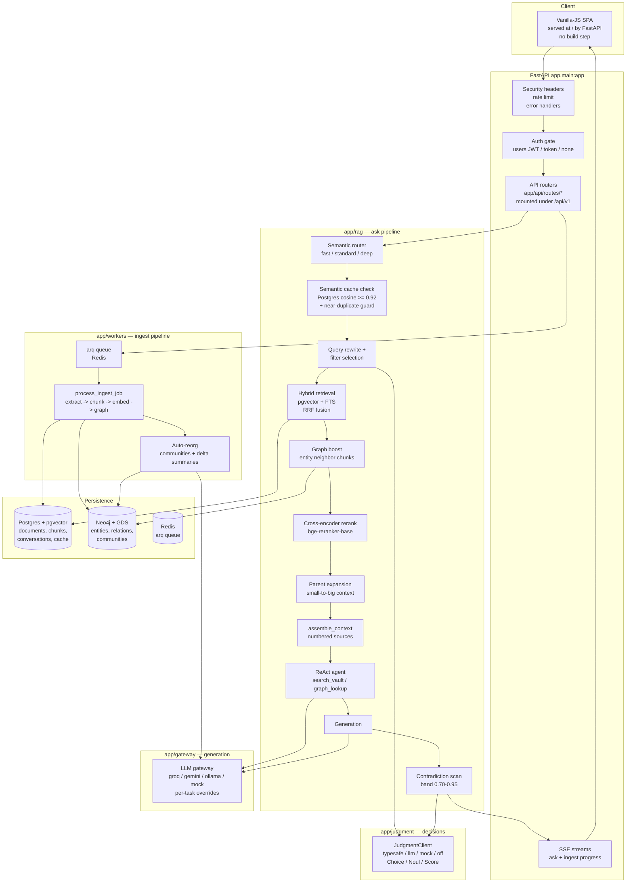
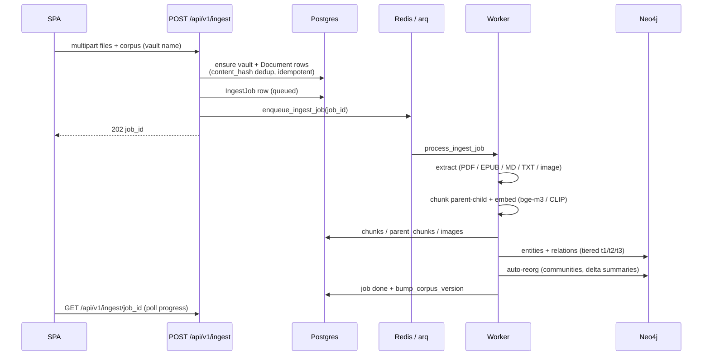
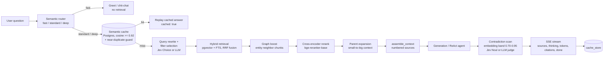
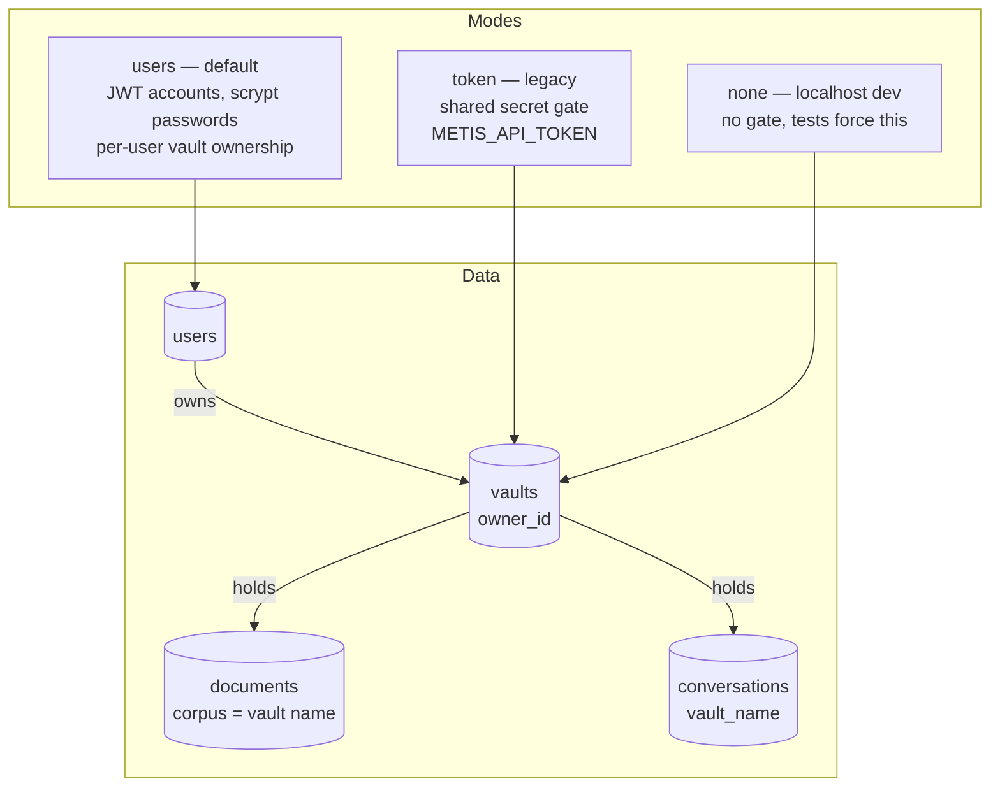
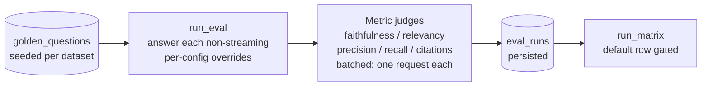

# METIS — The Self-Organizing Knowledge Library

> **One-liner:** The library that reads itself. Drop in documents and images; Metis builds a
> knowledge graph of everything inside, answers questions with citations, surfaces
> cross-document connections you didn't know existed, and flags contradictions between sources.

**Docs:** [JEV judgment layer](docs/jev.md) · [Architecture](docs/architecture.md) ·
[Deployment](docs/deployment.md) · [Changelog](CHANGELOG.md) · [Migration](MIGRATION.md) ·
[Portfolio material](docs/portfolio.md)

> **Deployment status:** not yet publicly deployed. The existing `render.yaml` blueprint
> cannot boot as written — the free tier is 512 MB / 0.1 CPU while the image loads
> `torch` plus a ~2.3 GB embedding model. `docs/deployment.md` has the measured options
> and the exact checklist; that decision is deliberately open rather than papered over.

## Features (what a user actually gets)

- **Accounts & private vaults** — register, sign in, and every vault/document/chat is scoped to your account (`METIS_AUTH_MODE=users` by default; `token`/`none` for scripts and localhost). The first account adopts pre-accounts vaults.
- **Ingest anything** — PDF, EPUB (books!), Markdown, plain text, images (CLIP + vision captions); drag-drop with live indexing progress. Content-hash dedup makes re-uploads idempotent.
- **Import connectors** — a web article by URL, your **Readwise** book highlights, or your **Zotero** library (per-request credentials, never stored).
- **Grounded chat** — streaming answers with numbered citations, per-source score cards, an agent mode that shows its tool calls, and a **document picker** to restrict any answer to a selection ("only compare these three papers").
- **Knowledge graph** — entities and relations extracted at ingest, communities detected and summarized, and an **interactive explorer**: click an entity, see its neighborhood, jump into a chat about it.
- **Self-organization** — the graph re-clusters and refreshes community summaries as documents arrive (debounced/nightly policies, audited).
- **Contradiction detection** — live alerts when retrieved sources disagree, plus a one-click **vault-wide report** with probability bars and both quotes side by side.
- **The library compounds** — save any answer as a note; it becomes a first-class, citable document.
- **Obsidian-friendly export** — one frontmattered markdown file per document plus graph entity/relation files.
- **Judgment layer** — Jev decides (metadata selection, contradiction verdicts, batched eval judging) while the LLM gateway generates; typed, calibrated, opt-in per task. See [docs/jev.md](docs/jev.md).

## Stack

FastAPI (async) · Postgres + pgvector · Neo4j (GDS) · Redis · sentence-transformers (bge-m3,
CLIP, bge-reranker) · LLM gateway (Groq + Gemini + ollama, free tiers, per-task overrides) ·
**TypeSafe Jev judgment layer** (typed, calibrated decisions) · arq worker · Langfuse.

## Architecture

Two pipelines: **ingest** (documents → chunks + knowledge graph) and **ask**
(question → cited answer). Postgres+pgvector is the source of truth, Redis is the job
queue, Neo4j holds the graph. Everything is async — the ask path streams over SSE.

### System overview



### Ingest pipeline (`app/workers/ingest.py` — arq job)



1. **Upload** — `POST /api/v1/ingest` creates the vault (if missing), document rows, and a job row; the worker polls Redis
   (`uv run arq app.workers.settings.WorkerSettings`) and runs `process_ingest_job`. 50 MB per-file cap; unsupported extensions are rejected with 400.
2. **Extraction** — per file: PDFs via PyMuPDF, EPUB via ebooklib, plain text/Markdown, images via CLIP + vision captions; **OCR fallback**
   (tesseract, `METIS_OCR_ENGINE=pytesseract`) when a PDF yields no text. Files that
   still come out empty get `extraction_status=empty` + a UI badge — never silent.
   Knowledge-graph extraction is **tiered** (runtime-settable, default `t1`):
   `t1` local regex per parent chunk (no API keys needed), `t2` t1 + LLM typed
   relations over sampled 8000-char windows, `t3` LLM per parent (capped); t2/t3
   fall back to t1 without keys. Entity/relation budgets bound the graph (200 each).
3. **Chunking** (P3.1 parent-child) — parents ~2000 chars; children (~400 chars,
   60 overlap) are cut *from* parents. Children are embedded and searched; context
   blocks come from the parent (small-to-big).
4. **Embedding** — children embedded with `bge-m3` (local CPU), images with CLIP;
   rows land in `chunks` / `parent_chunks` / `images`. `content_hash` dedupes
   re-uploads; `bump_corpus_version` invalidates stale caches.
5. **Knowledge graph** — tiered entity/relation extraction → Neo4j per-document
   graph; **GDS community detection** + per-community LLM summaries power the global
   sensemaking view. **Auto-reorg** (P8): after a successful batch the worker
   re-detects communities and re-summarizes only the communities whose membership
   changed (`members_hash` invalidation) — LLM spend is delta-only. Debounce policy,
   min-docs threshold, and auto-toggle are runtime settings; every run lands in the
   `reorg_runs` audit log (`/library/reorganizations`).
6. **Progress** — per-file status pollable at `GET /api/v1/ingest/{job_id}` (job row in Postgres, polled by the UI).

### Ask pipeline (`app/rag/pipeline.py` + friends)



1. **Route** (`app/rag/router.py`) — synchronous heuristic lanes: greetings/trivia →
   `fast` (no retrieval), comparisons/multi-source → `deep`, else `standard`; optional
   LLM refine (`METIS_ROUTER_LLM=true`). Never raises — defaults to `standard`.
2. **Cache check** (`app/cache.py`) — the question is embedded; the nearest
   `cache_entries` row within cosine ≥ 0.92, corpus-scoped, 7-day TTL and matching
   `corpus_version` replays the prior answer (UI shows a "cached" badge) — zero LLM calls.
   A **near-duplicate guard** (P8) blocks hits when the question text differs too
   much from the cached one (token Jaccard ≥ 0.8, length ratio ≤ 1.5, capitalized-token
   agreement): embedding-identical but entity-different questions never share a hit.
   Loose paraphrases miss by design — a documented accuracy-vs-hit-rate tradeoff.
3. **Retrieval** (`retrieve_context`) — optional LLM query rewrite, metadata-filter
   extraction (dates/tags), vector search (`<=>` pgvector) + keyword FTS fused with
   RRF; **graph boost** adds entity-neighbor chunks (2 hops, ≤10); cross-encoder
   rerank (`bge-reranker-base`, top 5); **parent expansion** resolves children → parents.
4. **Context assembly** (`app/rag/context.py`) — numbered sources; the model must cite `[n]`.
5. **Generation** — ReAct agent (`app/rag/agent.py`) when the provider supports tool
   calling (the model itself calls `search_vault` / `graph_lookup`); otherwise the
   direct path. Any failure degrades to direct retrieval → context →
   generation — never an empty reply.
6. **Contradiction scan** (`app/rag/pipeline.py` + `contradiction.py`) — chunk
   embeddings are compared pairwise; only pairs in the suspicious band
   (cosine 0.70–0.95 — semantically near but not identical) reach the LLM judge
   (≤ 4 pairs, persisted as Neo4j contradiction edges). Without embeddings it falls
   back to judging the top-2 chunks. Conflicts surface as a "sources disagree" alert.
7. **SSE stream** — `sources → thinking → tokens → citations → done`; answers +
   sources persisted per conversation.
8. **Feedback** (P6) — thumbs-down re-embeds the question and **evicts semantically
   matching cache entries**, so the same/similar question must be answered fresh.

### Auth & data ownership (`METIS_AUTH_MODE`)



- `users` (default): register via `POST /api/v1/auth/register`, sign in via `/auth/login`
  (JWT in `Authorization: Bearer`). Every vault/document/conversation/search route scopes
  through `owned_vault` / `vault_scope_guard` (`vaults.owner_id`, migration `0012`); the
  first registered account adopts pre-accounts vaults (`owner_id IS NULL`).
- `token`: the legacy shared-secret gate — `METIS_API_TOKEN` becomes active, accepted as
  `Authorization: Bearer`, `X-API-Token`, or `?token=` (downloads only). `/healthz`,
  `/auth/*`, and `/static/*` stay open.
- `none`: open localhost dev (tests force this in conftest).

### LLM gateway (`app/gateway/`)

Providers: Groq, Gemini, ollama (OpenAI-compatible), and a deterministic MockProvider
for no-key dev and tests. Tasks route per provider (`generation→groq`,
`judge/extraction→gemini`) with per-task overrides (`METIS_JUDGE_PROVIDER` /
`METIS_EXTRACTION_PROVIDER`); each call walks a fallback chain and never splices
mid-stream failures. Structured JSON-schema calls per task; per-request cost estimates.

The three OpenAI-compatible providers share one `OpenAICompatProvider` base
(`app/gateway/openai_compat.py`) — they had drifted into three copies of the same four
calls, which is how a retry fix ends up needing to be made in three places.

### Judgment layer (`app/judgment/` — [docs](docs/jev.md))

The gateway **generates** text; this layer **decides**. That distinction is the whole
reason it exists: every decision Metis made used to be a prompt whose free-text reply
was parsed and hoped about.

Jev (TypeSafe's System One model) ingests a `state` once and evaluates every question
against it **in parallel**, returning `Choice` / `Noul` / `Score` answers with calibrated
probabilities instead of prose. Thresholds live in code, not in prompt text.

| Integrated | What it replaced |
|---|---|
| Query-filter extraction | LLM *writing* tags → corpus tags enumerated as options, so an invented tag is unreachable |
| Contradiction verdict | Parsed JSON `true/false` → a probability thresholded in code, escalating when ambiguous |
| Eval judging | One LLM call **per claim/chunk** → **one request per metric** |
| Reranking, lane routing | Instrumented comparison backends, opt-in and **unmeasured** |

It is opt-in (`METIS_JUDGMENT_BACKEND`, default `llm` = the pre-existing paths, so
published numbers stay reproducible), every path falls back to the original, and a
judgment outage degrades a feature rather than failing a request.

### Eval gates

Golden datasets (`app/evals/datasets.py`) → harness (`app/evals/runner.py`) →
RAGAS-style metrics; `scripts/run_matrix.py` drives the config matrix and gates the
default config (faithfulness ≥ 0.90, context_precision ≥ 0.80, citation_correctness
== 1.0). The gate runs locally (a CI workflow was removed — the corpus-dependent
matrix kept skipping on fresh CI databases); it enforces thresholds only when
Postgres is reachable **and** the dataset's corpus is ingested, and exits 1 on any
breach. See Measured results below.



### Repository layout

```text
app/
  api/routes/     one router per endpoint group (mounted under /api/v1 in main.py)
  core/           settings (METIS_*), auth (JWT/scrypt), security (token gate/headers),
                  rate limits, logging, errors
  db/             SQLAlchemy async models (users, vaults, documents, chunks,
                  conversations, cache, evals) + session
  gateway/        provider clients + task routing (groq/gemini/ollama/mock)
  judgment/       TypeSafe Jev judgment layer: primitives, adapter, mock, policy
  rag/            router, retrieval, rerank, context, agent, contradiction, vision
  graph/          Neo4j store, extraction, communities (GDS)
  evals/          golden datasets, metrics, runner
  workers/        arq jobs (ingest, auto-reorg) + enqueue + runtime settings store
  schemas/        request/response models
  static/         dependency-free vanilla-JS SPA (served at /)
                  js/views: home, auth, ask, documents, graphview,
                            library, contradictions, settings + shell
scripts/          run_matrix, frontend_qa
tests/            pytest suite — mock models/LLMs, DB-gated fixtures
alembic/          async migrations (0012 = vault ownership)
```

## Quickstart

```bash
# 1. Infrastructure (Postgres+pgvector, Redis, Neo4j)
docker compose up -d db cache graph

# 2. Dependencies + env
uv sync
cp .env.example .env   # add GROQ_API_KEY / GEMINI_API_KEY

# 3. Migrations + dev server
uv run alembic upgrade head
uv run uvicorn app.main:app --reload

# 4. Ingest worker (required — /ingest jobs never run without it)
uv run arq app.workers.settings.WorkerSettings
```

Then open `http://127.0.0.1:8000`, **register the first account** (it adopts any
pre-accounts vaults), create a vault, and upload a file. In `token` mode set
`METIS_API_TOKEN` and paste it into the SPA prompt instead; in `none` mode just open
the app.

No API keys? Everything runs on the built-in mock provider; a local ollama model can be
substituted per task via `METIS_JUDGE_PROVIDER` / `METIS_EXTRACTION_PROVIDER` /
`METIS_PRIMARY_PROVIDER` (see `.env.example` and `docs/deployment.md`).

Optional — enable the judgment layer (`docs/jev.md`):

```bash
export TYPESAFE_API_KEY="ts-..."      # https://console.typesafe.ai (unprefixed name)
export METIS_JUDGMENT_BACKEND=typesafe
```

## Frontend

A hand-built, dependency-free single-page app served by FastAPI at `/` (no build step —
vanilla ES modules + CSS custom properties).

- **Auth** — register / sign in / sign out; JWT stored in `localStorage`; the app probes
  `/auth/me` on boot and redirects to the login view when accounts are enabled.
- **Vaults** — named libraries (`/vaults` API), per-user owned. Each vault holds its documents, its own
  knowledge graph, and a chat grounded in that vault's sources. Ingest reports per-file
  status, including OCR (`ocr`) and empty-document (`empty`) badges instead of silent gaps.
- **Documents** — library grid with per-file status, drag-and-drop upload with live job
  progress, and a detail view (raw content, chunk list, original file download).
- **Graph** — a bespoke canvas force-directed renderer: drag nodes, scroll to zoom,
  click an entity to expand its neighborhood, search to focus. No graph library — the
  physics and rendering are ~300 lines of first-party code. Communities (P5): GDS
  community detection + per-community LLM summaries power a "global" sensemaking view.
- **Ask** — SSE chat with token streaming, markdown answers, clickable citation chips,
  scored source cards, contradiction alerts, image attach, and a semantic-cache replay
  badge. A semantic router picks a fast/standard/deep lane per question (label shown in
  the UI); parent-child chunking keeps retrieval precise while the model reads full
  parent passages. **Thumbs up/down** on any answer: thumbs-down evicts the matching
  cache entries so a bad answer is never replayed. A **document picker** scopes any
  answer to a selection of documents.
- **Contradictions** — dedicated view + one-click **vault-wide contradiction report**
  (`POST /vaults/{name}/contradiction-report`) with probability bars and both quotes
  side by side.
- **Notes & export** — save any answer as a note (`POST /vaults/{name}/notes`; it becomes
  a first-class, citable document) and download an Obsidian-friendly zip
  (`GET /vaults/{name}/export`: frontmattered markdown per document + graph files).
- **Connectors** — import a web article by URL or pull in **Readwise** / **Zotero**
  libraries (`POST /imports/url|readwise|zotero`; credentials are per-request, never stored).
- **ReAct agent** — when the LLM provider supports function calling, the chat runs a
  tool-augmented reasoning loop: the model itself searches the vault and expands the
  knowledge graph before answering. The frontend shows a live "thinking" panel with each
  tool step as it happens.
- **Conversations** — every exchange is persisted server-side per vault (migration
  0005). Follow-ups carry full history back into the agent loop; the Ask view lists,
  switches, renames, and deletes past conversations.
- **Library** — the whole library as one graph (`/library` API): every vault rendered on
  a single canvas with vault-colored clusters and dashed cross-vault edges, live vault
  filters, and a **Surprises** tab that mines the graph for connections between vaults
  (shared concepts + cross-vault links) narrated in one LLM call.
- **Settings** — runtime settings (`#/settings`, `app_settings` table, no redeploy):
  graph extraction mode (`t1`/`t2`/`t3`) and LLM window count, auto-reorg toggle +
  debounce policy (`batch`/`debounced`/`nightly`) + min-docs threshold, plus the reorg
  audit log (every community-detection run, manual or automatic) with a "run
  reorganization now" button.
- **Idea journeys** — pick any two entities (search-as-you-type pickers) and Metis finds
  the shortest path between them across all vaults, highlights it on the graph, and
  narrates the journey as a short story.
- **Resilience** — when the LLM providers are rate-limited, the agent falls back to
  direct hybrid retrieval → context assembly → generation, so answers stay grounded in
  real vault sources instead of degrading to an empty reply.
- **Themes** — "Reading Room" (light) and "Night Archive" (dark), system-aware,
  persisted, with a live-recolored graph. Typefaces (Spectral / Inter / IBM Plex Mono)
  are self-hosted.

Run the end-to-end UI check (headless Chromium, verifies home/vaults/graph/ask/themes
and fails on any console error). It auto-registers `qa@metis.local`:

```bash
# default target is :8011 — start the app there first
uv run uvicorn app.main:app --port 8011
uv run python scripts/frontend_qa.py
```

## API surface

Auth mode changes what the gate enforces (see Security). In `users` mode every
vault/document/conversation/search route requires a JWT and is scoped to the caller;
in `token` mode the same routes require `METIS_API_TOKEN` (`Authorization: Bearer`,
`X-API-Token`, or `?token=`); `/healthz`, `/auth/*`, and `/static/*` stay open.

| Endpoint | Method | Purpose |
|---|---|---|
| `/healthz` | GET | Liveness + readiness (no prefix, always open) |
| `/api/v1/auth/register` | POST | Register account (users mode; first account adopts orphan vaults) |
| `/api/v1/auth/login` | POST | Sign in, returns JWT |
| `/api/v1/auth/me` | GET | Current account |
| `/api/v1/ingest` | POST (multipart) | Upload files + corpus (vault name) → `job_id` |
| `/api/v1/ingest/{job_id}` | GET | Job progress |
| `/api/v1/corpora` | GET | Corpora + doc counts + graph stats |
| `/api/v1/ask` | POST | Ask with SSE stream (`sources → thinking → tokens → citations → done`) |
| `/api/v1/vaults` | GET/POST | List / create vaults (owned) |
| `/api/v1/vaults/{name}` | GET/PATCH/DELETE | Vault detail, rename/color, delete (+ graph cleanup) |
| `/api/v1/vaults/{name}/documents` | GET | Documents in a vault with chunk/image counts + status |
| `/api/v1/vaults/{name}/graph` | GET | Vault graph stats + communities (GDS) |
| `/api/v1/vaults/{name}/suggestions` | GET | Starter questions mined from top entities |
| `/api/v1/vaults/{name}/export` | GET | Obsidian zip (frontmattered markdown + graph files) |
| `/api/v1/vaults/{name}/notes` | POST | Save an answer as a note (becomes a citable document) |
| `/api/v1/vaults/{name}/contradiction-report` | POST | Vault-wide contradiction scan with probabilities |
| `/api/v1/documents/recent` | GET | Recently ingested documents (owned scope) |
| `/api/v1/documents/{doc_id}` | GET/DELETE | Document detail / delete (+ graph cleanup) |
| `/api/v1/documents/{doc_id}/content` | GET | Raw extracted text |
| `/api/v1/documents/{doc_id}/chunks` | GET | Chunk list |
| `/api/v1/documents/{doc_id}/file` | GET | Original file download |
| `/api/v1/documents/{doc_id}/metadata` | PATCH | Edit tags/date/author |
| `/api/v1/vaults/{name}/conversations` | GET/POST | List / create conversations for a vault |
| `/api/v1/conversations/{id}` | GET/PATCH/DELETE | Conversation detail, rename, delete |
| `/api/v1/conversations/{id}/messages` | GET | Message history for a conversation |
| `/api/v1/ask/{message_id}/feedback` | POST | Rate an answer (`-1`/`1`); `-1` evicts matching semantic-cache entries |
| `/api/v1/evals/feedback` | GET | Feedback log (ratings joined with conversations) |
| `/api/v1/search` | GET | Raw hybrid search |
| `/api/v1/graph/explore` | GET | Subgraph around an entity |
| `/api/v1/graph/connections` | GET | Path between two entities |
| `/api/v1/graph/stats` | GET | Node/edge counts, top entities by PageRank |
| `/api/v1/graph/communities` | POST | Manual community detection + summary refresh (logged) |
| `/api/v1/cache/stats` | GET | Semantic cache hit rate |
| `/api/v1/library/graph` | GET | Cross-vault library graph (corpus-tagged nodes, bridge flags) |
| `/api/v1/library/entities` | GET | Entity search for the journey pickers |
| `/api/v1/library/surprises` | GET | Mined cross-vault connections with LLM narratives |
| `/api/v1/library/journey` | GET | Shortest entity path across vaults + narrated story |
| `/api/v1/library/reorganizations` | GET | Auto-reorg audit log (every run, manual or automatic) |
| `/api/v1/imports/url` | POST | Ingest a web article by URL |
| `/api/v1/imports/readwise` | POST | Ingest Readwise highlights (per-request token) |
| `/api/v1/imports/zotero` | POST | Ingest a Zotero library (per-request key) |
| `/api/v1/settings` | GET/PUT | Runtime settings (`app_settings` overrides, env defaults) |
| `/api/v1/evals/run` | POST | Run the eval harness |
| `/api/v1/evals/reports` | GET | Past eval runs + metrics |

## Security

Metis has three auth modes (`METIS_AUTH_MODE`, `app/core/auth.py` + `app/core/security.py`):

- **`users` (default)** — real accounts: scrypt password hashes, per-user JWTs
  (`METIS_SECRET_KEY` signs them — change it in any shared deployment), per-user vault
  ownership via `vaults.owner_id` (migration `0012`; the first registered account adopts
  pre-accounts vaults). Every vault/document/conversation/search route takes a user and
  scopes through `owned_vault` / `vault_scope_guard`.
- **`token` (legacy shared-secret gate)** — set `METIS_API_TOKEN` and every protected
  route requires it (empty keeps local use open). Constant-time comparison;
  `/healthz`, `/auth/*`, and `/static/*` stay open so monitoring and the prompt keep
  working. The SPA prompts once and stores the token.
- **`none`** — open localhost dev (tests force this in conftest).

Plus, in every mode:

- **Headers:** `nosniff`, frame-deny, referrer-policy, permissions-policy, and a CSP that
  keeps `script-src 'self'`; HSTS when `METIS_ENV=prod`.
- **Rate limiting:** per-client with `Retry-After`; `METIS_TRUST_PROXY_HEADERS` makes it
  key on `X-Forwarded-For` behind a proxy that overwrites the header (off by default,
  since the header is client-forgeable — otherwise every visitor shares one bucket).
- **Rendering:** the markdown renderer escapes before it transforms, so model answer
  text reaches `innerHTML` already neutralised.

## Tests

```bash
uv run pytest                       # infra-gated tests auto-skip without docker
uv run pytest -q tests/test_judgment.py tests/test_judgment_metrics.py \
  tests/test_judgment_backends.py   # judgment layer, no API key needed
```

CI (`.github/workflows/ci.yml`) runs `ruff check`, `ruff format --check`, and `pytest` with
**no thresholds** — both lint gates are absolute. The corpus-dependent eval matrix is
*not* in CI because it needs an ingested corpus; it stays a deliberate local gate.

## Measured results

The eval harness (`/evals/run`, `scripts/run_matrix.py`) scores the retrieval pipeline
against golden datasets with RAGAS-style LLM-judged metrics. Numbers below are from
real runs on the current parent-child corpus (Groq `llama-3.3-70b` generation + judges,
local CPU embeddings, single pass per config, 2026-08-14).

### tech (`fastapi-notes` corpus, 4 questions)

| Config | Faithfulness | Answer relevancy | Context precision | Context recall | Citations | p50 latency |
|---|---|---|---|---|---|---|
| hybrid + rerank + graph | **1.000** | 0.829 | **1.000** | **1.000** | **1.000** | 2.50s |
| hybrid only | 1.000 | 0.883 | 0.000* | 0.750 | 0.000* | 6.03s |
| rerank only (no graph) | 1.000 | 0.845 | 0.000* | 0.750 | 0.000* | 5.80s |
| parent-child | 0.854 | 0.793 | **1.000** | **1.000** | **1.000** | 9.42s |
| flat (no parent-child) | 0.688 | 0.889 | 0.563 | 0.750 | 0.500 | 18.53s |
| metadata filter off | 0.938 | 0.873 | **1.000** | **1.000** | **1.000** | 7.07s |

\* `hybrid only` / `rerank only (no graph)` hit the Groq free-tier daily token limit
during that pass and fell back to the mock provider — the zeros are quota artifacts,
not pipeline behavior. Re-run these rows after the daily token window resets
(`uv run python -m scripts.run_matrix tech`).

### Philosophy (10-document corpus, 5 questions)

| Config | Faithfulness | Answer relevancy | Context precision | Context recall | Citations | p50 latency |
|---|---|---|---|---|---|---|
| hybrid + rerank + graph | 0.200 | 0.615 | 0.848 | 0.800 | 1.000 | 20.3s |

Notes:

- **Faithfulness** is claim-level and strict: a verbose answer with one unsourced
  sentence scores low. The Philosophy run's 0.200 reflects the model adding
  background reasoning beyond the retrieved chunk (e.g. Kant) — retrieval itself
  stayed recall-perfect at 0.800 with 1.000 citation correctness.
- Metrics are LLM-judged, so expect ±0.05–0.1 variance between runs; latency
  includes CPU embedding + generation.
- Corpus sizes differ heavily: `tech` = 1 doc / 4 chunks (parent-child), `Philosophy`
  = 10 texts / ~6,800 chunks — the ~8x latency gap is mostly retrieval over the
  big corpus.
- `parent-child` vs `flat` is the P3.1 small-to-big comparison: resolving children
  to their parents recovers citation correctness (0.500 → 1.000) at the cost of
  latency (18.5s → 9.4s context assembly + larger windows).

The `hybrid only` / `rerank only` rows above fell back to the mock provider after the
Groq daily token limit was hit mid-run: the judge made **one call per claim and per
chunk**, so a single eval pass could exhaust a free tier. With a judgment backend
configured those metrics batch to **one request each** (`app/evals/metrics.py`), which
removes that failure mode — re-run the rows after switching to see it. The comparison
backends are not yet measured against their originals; the commands are in
[`CHANGELOG.md`](CHANGELOG.md).

Reproduce with `uv run python -m scripts.run_matrix tech` (or `Philosophy`).
`eval_runs` are persisted and browsable at `/evals/reports`. Only the default
config (`hybrid+rerank+graph`) is gated (faithfulness ≥ 0.90, context precision
≥ 0.80, citation correctness == 1.0); the other rows are comparison
configs that are intentionally worse by design (see `scripts/run_matrix.py`).
