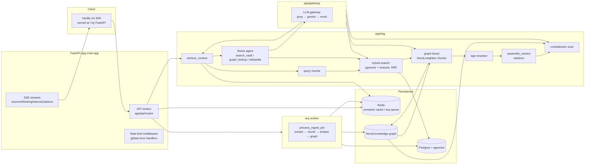

# METIS — Architecture

> How the pieces fit: entrypoints, data flow, and the "why" behind the design
> decisions. See [metis-blueprint.md](../metis-blueprint.md) for the product
> vision and [deployment.md](deployment.md) for infrastructure.

## System overview

## Request flows

### `/ask` (chat, SSE)

1. **Route** `app/api/routes/ask.py` → `app/rag/pipeline.py:ask_events`.
   Emits SSE events in order: `sources → thinking → tokens → citations → contradiction → done`.
2. **Agent or direct:** if the gateway provider supports tool calling, the ReAct
   agent (`app/rag/agent.py`) runs — the model itself calls `search_vault`,
   `graph_lookup`, `wikipedia` in a loop. Providers without tools (or image
   queries) take the direct path. On agent failure or rate-limiting, the pipeline
   degrades to direct retrieval → context → generation (never an empty reply).
3. **Direct path** (`retrieve_context`, `app/rag/pipeline.py:58`):
   - query **rewrite** (`app/rag/rewrite.py`) via the fast model
   - **hybrid search**: pgvector cosine (`vector_search`) + Postgres tsvector
     (`keyword_search`), fused with Reciprocal Rank Fusion (`fuse_hybrid`)
   - **graph boost**: extract entities from the query → Neo4j neighbour chunks
     merged into the candidate set
   - **rerank** with bge-reranker-base (`app/rag/rerank.py`) → top-k
4. **Context assembly** (`app/rag/context.py`) builds the prompt with source
   numbers; the model must cite `[n]`.
5. **Contradiction check** (`app/rag/contradiction.py`): if the top two chunks
   share a `CONTRADICTS` edge in Neo4j, an alert object rides along in `done`.
6. **Semantic cache** (`app/cache.py`): exact/similar queries (cosine ≥ 0.92)
   replay the cached answer — surfaced to the UI as a "cached" badge.
7. Answers are persisted per conversation (`conversations` tables, migration
   0005); follow-ups carry full history into the agent loop.

### `/ingest` (upload → knowledge)

1. `POST /api/v1/ingest` (multipart) stores the raw file under `uploads/`,
   inserts a `Document` (content-hash dedup → idempotent re-uploads skip), and
   enqueues an arq job (`app/workers/enqueue.py`).
2. The **arq worker** (`app/workers/ingest.py`, one function: `process_ingest_job`)
   runs extraction → chunking (`app/rag/chunking.py`) → bge-m3 embeddings →
   chunk rows with pgvector → entity extraction → Neo4j nodes/edges.
3. Images: CLIP embedding + Gemini caption/OCR (`app/rag/vision.py`); `ImageRecord`
   rows feed image retrieval.
4. Progress is pollable at `/api/v1/ingest/{job_id}`; jobs time out at 1h with
   max 2 concurrent (`app/workers/settings.py`).

### `/evals/run` (meet: the harness)

Golden questions (`app/evals/datasets.py`, seeded into `golden_questions`) →
`run_eval` (`app/evals/runner.py`) answers each non-streaming with per-config
overrides → RAGAS-style metric judges (`app/evals/metrics.py`):
faithfulness, answer relevancy, context precision/recall, citation correctness
+ latency p50/p95 and cost. Runs persist as `EvalRun` rows; `/evals/reports`
lists them. `scripts/run_matrix.py` drives a config matrix across a dataset.

## Design decisions

| Decision | Why |
|---|---|
| **Gateway abstraction with mock fallback** (`app/gateway/`) | Groq/Gemini are OpenAI-compatible but tiny behavioral differences (tool-call formats, rate-limit shapes) — one interface, deterministic `MockProvider` for tests and no-key dev. Providers chain groq → gemini → mock per task (`TASK_PROVIDER`). |
| **Hybrid + RRF + rerank** | Vector catches semantic match, tsvector catches exact terms (names, IDs); RRF fuses rank lists without score calibration; the reranker fixes order noise from both. Measured: see README "Measured results". |
| **Graph boost is best-effort** | Entity extraction + traversal costs a Gemini call per query; wrapped so any failure degrades to hybrid-only, never breaks ask (proven in the measured matrix). |
| **No mid-stream fallback splicing** | If a provider dies mid-stream, abort instead of concatenating a second provider's output over the first's partial tokens (`gateway.py:chat_stream`). |
| **Neo4j for cross-doc structure** | Chunk-chunk `CONTAINS` edges, entity nodes, `MENTIONS`/`RELATED_TO`/`CONTRADICTS` edges → graph search, contradiction detection, and the cross-vault Library graph all run on one store. |
| **arq + Redis for jobs** | Cheap, no orchestrator; the worker is a separate process so heavy CPU embeddings never block the API event loop. |
| **CPU-only torch pin** | `pyproject.toml` pins torch/torchvision to the official CPU index — models run locally, free, offline after first download. Do not drop unless CUDA is intended. |
| **Transformers `<5` pin** | transformers 5.x dropped the processor loading path `bge-m3` needs (fresh processes crashed loading weights; only long-lived processes with old libs in memory survived). |

## Layout map

- `app/api/routes/` — one router file per endpoint group, mounted in `app/main.py`
  under `/api/v1`; the SPA fallback route serves `index.html` for anything else.
- `app/core/` — settings (env `METIS_*`), error handlers, rate limiting, logging,
  Langfuse tracing.
- `app/db/` — SQLAlchemy async models; alembic migrations in `alembic/`
  (async env reads `settings.db_url`; new models register via `import app.db.models`).
- `app/rag/` — retrieval pipeline, rerank, context, contradiction, agent, vision.
- `app/graph/` — Neo4j store (`store.py`) + LLM entity extraction (`extraction.py`).
- `app/gateway/` — provider clients (`groq.py`, `gemini.py`, `mock.py`) + routing.
- `app/evals/` — datasets, metrics, runner.
- `app/workers/` — arq worker settings + ingest job.
- `app/static/` — the SPA (no build step; edit `app/static/js/**` directly).

## Testing map

- `tests/conftest.py` forces mock embed/rerank/CLIP models before app import —
  tests never download weights. DB/Redis/Neo4j-dependent tests skip via
  `require_db`/`require_redis`/`require_graph` when infra is down.
- `tests/test_agent.py`, `test_ask.py` — ask pipeline + agent loop (mock gateway).
- `tests/test_retrieval.py`, `test_hybrid.py`, `test_rerank.py` — retrieval stack.
- `tests/test_ingest.py` — worker job (mock gateway, mocked graph).
- `tests/test_evals.py`, `test_metrics.py` — harness + judge metrics.
- Frontend: `uv run python scripts/frontend_qa.py` (Playwright, expects server on :8011).