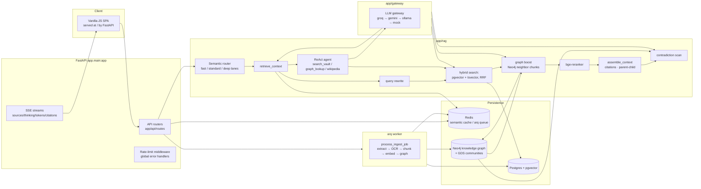

# METIS — Architecture

> How the pieces fit: entrypoints, data flow, and the "why" behind the design
> decisions. See [deployment.md](deployment.md) for infrastructure and the
> README for feature overview.

## System overview

## Request flows

### `/ask` (chat, SSE)

1. **Route** `app/api/routes/ask.py` → `app/rag/router.py:route_question`.
   Emits SSE events in order: `sources → thinking → tokens → citations → contradiction → done`.
2. **Semantic router** (`app/rag/router.py`): cheap classifier decides the
   *lane* — **fast** (simple lookups, no rewrite/agent), **standard**, or
   **deep** (complex/multi-hop, ReAct agent). Configurable via
   `METIS_ROUTER_*` settings; fallback to standard on any router failure.
3. **Cache v2** (`app/cache.py`): before retrieval, the question is embedded
   and compared (cosine ≥ `cache_similarity_threshold`) against stored
   question embeddings, **scoped per corpus**. A hit replays the exact SSE
   sequence (`cached: true` in `done`) without any LLM call. Answers are
   stored after the first full run with their sources and question embedding.
4. **Agent or direct:** if the gateway provider supports tool calling, the
   ReAct agent (`app/rag/agent.py`) runs — the model itself calls
   `search_vault`, `graph_lookup`, `wikipedia` in a loop. Providers without
   tools (or image queries) take the direct path. On agent failure or
   rate-limiting, the pipeline degrades to direct retrieval → context →
   generation (never an empty reply).
5. **Direct path** (`retrieve_context`, `app/rag/pipeline.py`):
   - query **rewrite** (`app/rag/rewrite.py`) via the fast model
   - **hybrid search**: pgvector cosine (`vector_search`) + Postgres tsvector
     (`keyword_search`), fused with Reciprocal Rank Fusion (`fuse_hybrid`)
   - **graph boost**: extract entities from the query → Neo4j neighbour chunks
     merged into the candidate set
   - **rerank** with bge-reranker-base (`app/rag/rerank.py`) → top-k
6. **Context assembly** (`app/rag/context.py`) builds the prompt with source
   numbers (parents for context, children as retrievable units — see
   parent-child chunking below); the model must cite `[n]`.
7. **Contradiction check** (`app/rag/contradiction.py`): if the top two chunks
   share a `CONTRADICTS` edge in Neo4j, an alert object rides along in `done`.
8. **Persistence:** answers + sources are persisted per conversation
   (migrations 0005+); follow-ups carry full history into the agent loop.
9. **Feedback** (`POST /ask/{message_id}/feedback`, P6): thumbs up/down on an
   answer. **Negative feedback evicts matching cache entries** — the original
   question is re-embedded and entries within the similarity threshold are
   deleted, so the same/similar question must be answered fresh next time.

### `/ingest` (upload → knowledge)

1. `POST /api/v1/ingest` (multipart) stores the raw file under `uploads/`,
   inserts a `Document` (content-hash dedup → idempotent re-uploads skip), and
   enqueues an arq job (`app/workers/enqueue.py`).
2. The **arq worker** (`app/workers/ingest.py`, one function: `process_ingest_job`)
   runs extraction → chunking (`app/rag/chunking.py`) → bge-m3 embeddings →
   chunk rows with pgvector → entity extraction → Neo4j nodes/edges.
3. **Parent-child chunking** (P4): long texts are cut into structure-preserving
   *parent* blocks (~`parent_size` chars, never splitting mid-paragraph);
   *children* (~`chunk_size`) are cut from each parent and link back via
   `parent_id`. Retrieval matches children (small, precise); context assembly
   shows the parent for grounding. Flat chunking behind `parent_child=false`.
4. **OCR** (P6, `METIS_OCR_ENGINE=pytesseract`): zero-text PDFs are rasterized
   (PyMuPDF) and OCR'd (tesseract). Success marks the document
   `extraction_status=ocr`; persistent failure marks it `empty` with an ingest
   log warning — never silent.
5. **Graph extraction** (P5): LLM (JSON mode) extracts entities + relations
   per document into Neo4j (`app/graph/extraction.py`); `app/graph/communities.py`
   runs GDS community detection and per-community LLM summaries for global
   answers.
6. Images: CLIP embedding + Gemini caption/OCR (`app/rag/vision.py`);
   `ImageRecord` rows feed image retrieval.
7. Progress is pollable at `/api/v1/ingest/{job_id}`; jobs time out at 1h with
   max 2 concurrent (`app/workers/settings.py`).

### `/evals/run` (meet: the harness)

Golden questions (`app/evals/datasets.py`, seeded into `golden_questions`) →
`run_eval` (`app/evals/runner.py`) answers each non-streaming with per-config
overrides → RAGAS-style metric judges (`app/evals/metrics.py`):
faithfulness, answer relevancy, context precision/recall, citation correctness
+ latency p50/p95 and cost. Runs persist as `EvalRun` rows; `/evals/reports`
lists them. `scripts/run_matrix.py` drives a config matrix across a dataset
with CI thresholds (faithfulness ≥ 0.90, context_precision ≥ 0.80,
citation_correctness == 1.0), skip-if-down, exit 1 on breach. `GET
/evals/feedback` surfaces user thumbs up/down for eval tooling.

## Design decisions

| Decision | Why |
|---|---|
| **Gateway abstraction with mock fallback** (`app/gateway/`) | Groq/Gemini are OpenAI-compatible but tiny behavioral differences (tool-call formats, rate-limit shapes) — one interface, deterministic `MockProvider` for tests and no-key dev. Providers chain preferred → others → mock per task (`TASK_PROVIDER`, overridable per task via `METIS_JUDGE_PROVIDER`/`METIS_EXTRACTION_PROVIDER` — e.g. offload to ollama when free tiers are exhausted). |
| **Hybrid + RRF + rerank** | Vector catches semantic match, tsvector catches exact terms (names, IDs); RRF fuses rank lists without score calibration; the reranker fixes order noise from both. Measured: see README "Measured results". |
| **Graph boost is best-effort** | Entity extraction + traversal costs an LLM call per query; wrapped so any failure degrades to hybrid-only, never breaks ask (proven in the measured matrix). |
| **Semantic router** (`app/rag/router.py`) | Not every question needs the full pipeline. Router-first cuts latency and LLM spend on simple lookups; deep lane keeps agent reasoning for multi-hop. Behind `METIS_ROUTER_*` kill switches. |
| **Parent-child chunking** | Children are precise retrieval units; parents give the model context. Avoids both too-small (unfocused) and too-large (diluted) chunks. Behind `parent_child` kill switch. |
| **Cache v2 (corpus-scoped, evictable)** | Embedding-question cache replays identical/similar asks at ~zero cost; corpus scoping prevents cross-vault pollution; negative user feedback evicts poisoned entries. |
| **No mid-stream fallback splicing** | If a provider dies mid-stream, abort instead of concatenating a second provider's output over the first's partial tokens (`gateway.py:chat_stream`). |
| **Neo4j for cross-doc structure** | Chunk-chunk `CONTAINS` edges, entity nodes, `MENTIONS`/`RELATED_TO`/`CONTRADICTS` edges → graph search, contradiction detection, communities, and the cross-vault Library graph all run on one store. |
| **arq + Redis for jobs** | Cheap, no orchestrator; the worker is a separate process so heavy CPU embeddings never block the API event loop. |
| **CPU-only torch pin** | `pyproject.toml` pins torch/torchvision to the official CPU index — models run locally, free, offline after first download. Do not drop unless CUDA is intended. |
| **Transformers `<5` pin** | transformers 5.x dropped the processor loading path `bge-m3` needs (fresh processes crashed loading weights; only long-lived processes with old libs in memory survived). |

## Layout map

- `app/api/routes/` — one router file per endpoint group, mounted in `app/main.py`
  under `/api/v1`; the SPA fallback route serves `index.html` for anything else.
- `app/core/` — settings (env `METIS_*`), error handlers, rate limiting, logging,
  Langfuse tracing.
- `app/db/` — SQLAlchemy async models (documents, chunks, conversations,
  feedback, cache entries, eval runs); alembic migrations in `alembic/`
  (async env reads `settings.db_url`; new models register via `import app.db.models`).
- `app/rag/` — router (lanes), retrieval pipeline, chunking (parent-child),
  rerank, context, contradiction, agent, vision.
- `app/graph/` — Neo4j store (`store.py`) + LLM entity extraction
  (`extraction.py`) + community detection/summaries (`communities.py`).
- `app/gateway/` — provider clients (`groq.py`, `gemini.py`, `ollama.py`,
  `mock.py`) + task routing.
- `app/evals/` — datasets, metrics, runner.
- `app/workers/` — arq worker settings + ingest job.
- `app/static/` — the SPA (no build step; edit `app/static/js/**` directly).

## Testing map

- `tests/conftest.py` forces mock embed/rerank/CLIP models before app import —
  tests never download weights. DB/Redis/Neo4j-dependent tests skip via
  `require_db`/`require_redis`/`require_graph` when infra is down.
- `tests/test_agent.py`, `test_ask.py` — ask pipeline + agent loop (mock gateway).
- `tests/test_retrieval.py`, `test_hybrid.py`, `test_rerank.py` — retrieval stack.
- `tests/test_router.py` — lane classification + router fallbacks.
- `tests/test_ingest.py` — worker job (mock gateway, mocked graph).
- `tests/test_ocr.py` — OCR/empty extraction status (skips without tesseract).
- `tests/test_feedback.py` — feedback endpoint + cache eviction.
- `tests/test_ollama.py`, `test_gateway.py` — provider clients + task routing.
- `tests/test_evals.py`, `test_metrics.py` — harness + judge metrics.
- Frontend: `uv run python scripts/frontend_qa.py` (Playwright, expects server on :8011).